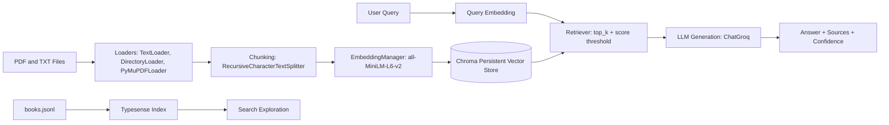

# RAG Lab: From Raw PDFs to Grounded Answers

[](https://www.python.org/)
[](https://www.langchain.com/)
[](https://www.trychroma.com/)
[](https://typesense.org/)
[](notebook/document.ipynb)

A practical, notebook-first playground for Retrieval-Augmented Generation (RAG) using real files, real embeddings, and real retrieval behavior.

This project is built for learning by doing. You can start with raw PDF/TXT files, index them, retrieve relevant chunks, and generate grounded answers with citations and confidence signals.

## Why This Project Stands Out

- Two retrieval worlds in one workspace:
	- semantic retrieval with ChromaDB
	- lexical/discovery search with Typesense
- Progressive notebook pipeline:
	- ingestion -> chunking -> embedding -> indexing -> retrieval -> generation
- Multiple answer modes:
	- baseline response
	- threshold fallback
	- duplicate-chunk cleanup
	- source previews + confidence score
	- optional history and summarization

## Architecture



## Tech Stack

- Python 3.11+
- LangChain, LangChain Community, LangChain Core
- ChromaDB (persistent vector store)
- Sentence Transformers (all-MiniLM-L6-v2)
- FAISS (similarity/search experimentation)
- Groq via langchain-groq
- PyMuPDF / PyPDF loaders
- Typesense for structured search experiments

## Project Layout

```text
RAG/
	data/
		pdf_files/                 # Put your PDFs here
		text_files/                # Local text documents for ingestion
		vector_store/              # Persistent ChromaDB state
	notebook/
		document.ipynb             # Main end-to-end RAG pipeline
	typesense.ipynb              # Typesense indexing + search experiments
	books.jsonl                  # Books dataset for search workflow
	requirements.txt
	pyproject.toml
	main.py                      # Placeholder runtime entry-point
```

## Quick Start (Windows PowerShell)

1. Create and activate a virtual environment

```powershell
python -m venv .venv
.\.venv\Scripts\Activate.ps1
```

2. Install dependencies

```powershell
pip install -r requirements.txt
```

3. Create a .env file in the project root

```env
GROQ_API_KEY=your_groq_api_key
TYPESENSE_API_KEY=your_typesense_api_key
TYPESENSE_HOST=your_typesense_host
TYPESENSE_PORT=443
TYPESENSE_PROTOCOL=https
```

4. Run notebooks in order
- notebook/document.ipynb for full RAG pipeline
- typesense.ipynb for search indexing and querying

## Notebook Flow

### notebook/document.ipynb

1. Ingestion:
- TextLoader and DirectoryLoader for TXT
- PyMuPDFLoader for PDFs

2. Chunking:
- RecursiveCharacterTextSplitter
- Tunable chunk_size and chunk_overlap

3. Embeddings:
- EmbeddingManager wraps SentenceTransformer

4. Vector store:
- VectorStore class uses persistent Chroma collection
- Saves IDs, metadata, chunks, embeddings

5. Retrieval:
- RAGRetriver with top_k and score threshold

6. Generation:
- simple_rag for baseline answers
- rag_advanced for fallback, deduplication, confidence, sources
- advancedRAGPipeline for citations, history, summarization

### typesense.ipynb

- Reads and indexes books.jsonl
- Enables searchable and filterable metadata
- Complements semantic retrieval with lexical search

## Pipeline Comparison

| Pipeline | Retrieval Strategy | Output Style | Reliability Features | Best For | Trade-offs |
|---|---|---|---|---|---|
| simple_rag | Top-k retrieval via Chroma with default retriever settings | Plain answer text from LLM | Minimal guardrails | Fast baseline demos and first-pass checks | No confidence score, no dedup, limited source transparency |
| rag_advanced | Top-k + score threshold with fallback to threshold 0.0 | Structured output: answer, sources, confidence (optional context) | Threshold fallback, duplicate chunk removal, source previews, confidence estimation | Better grounded answers and debugging retrieval quality | Slightly more complexity and extra retrieval logic |
| advancedRAGPipeline | Top-k + configurable min_score through retriever | Answer with inline citations, optional summary, conversation history | Citation formatting, history tracking, optional summarization, source metadata retention | Interactive Q&A sessions and explainable responses | More moving parts; response formatting and state handling overhead |

### Which One Should You Use?

- Start with `simple_rag` to validate your index and model wiring.
- Move to `rag_advanced` when you want stronger answer quality controls.
- Use `advancedRAGPipeline` when you need citations, memory, or summary-ready outputs.

## Sample Results

Representative outputs from the notebook workflow:

- Query: What is supervised learning?
	- Output style: concise multi-sentence explanation grounded in retrieved chunks
- Query: what is PCA?
	- Output style: answer plus top source pages and similarity-derived confidence
- Query: what is unsupervised learning?
	- Output style: answer with citations and optional short summary

Quality signals produced by the advanced flow:

- confidence score from top retrieved similarity
- source previews for traceability
- threshold fallback when strict filters return no context
- deduplication of repeated chunks after re-indexing

## Prompts To Try

- What is supervised learning?
- Explain unsupervised learning in simple language.
- What does PCA do, and when should I use it?
- Compare retrieval and generation in one short answer.

## Security Notes

- Never hardcode API keys in notebooks.
- Keep secrets in .env.
- Rotate keys if they are exposed.

## Current Status

- Notebook pipeline is functional for experimentation.
- main.py is still a placeholder and does not yet orchestrate the full pipeline.

## Roadmap

1. Extract notebook classes into src modules.
2. Build a CLI in main.py with ingest, index, and ask commands.
3. Add tests for chunking, retrieval thresholds, and dedup logic.
4. Add lightweight evaluation for groundedness and source relevance.
5. Add a simple API/UI layer for interactive querying.

## Troubleshooting

- Embeddings fail:
	- Verify internet access for first model download.
	- Confirm sentence-transformers is installed.
- No retrieval results:
	- Lower score threshold.
	- Increase top_k.
	- Rebuild index after adding files.
- Stale or duplicated results:
	- Clear and rebuild data/vector_store.
- LLM errors:
	- Validate GROQ_API_KEY.
	- Confirm model availability in your Groq account.

---

Built as an experimentation lab for mastering practical RAG design with real retrieval behavior, observable outputs, and iterative notebook-driven development.
